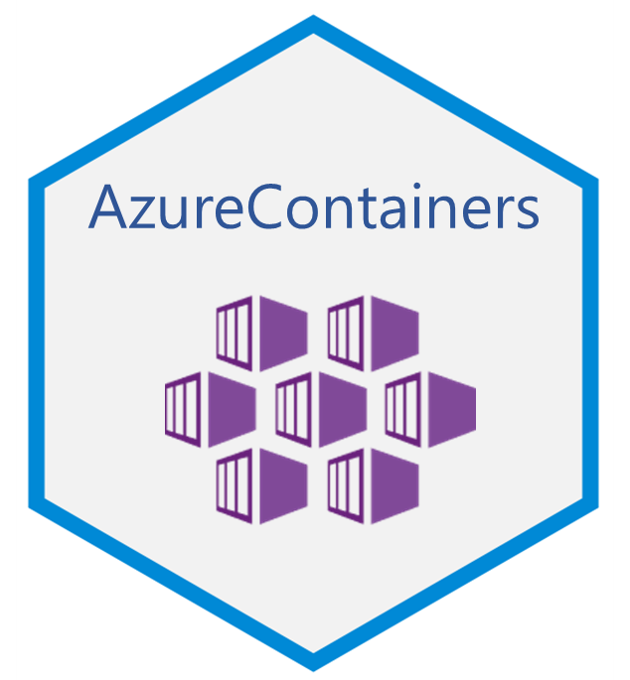

# AzureContainers 

[](https://cran.r-project.org/package=AzureContainers)

[](https://travis-ci.org/Azure/AzureContainers)

A package for working with [Azure Container Registry (ACR)](https://azure.microsoft.com/en-us/services/container-registry/), [Azure Kubernetes Service (AKS)](https://azure.microsoft.com/en-us/services/kubernetes-service/) and [Azure Container Instances (ACI)](https://azure.microsoft.com/en-us/services/container-instances/). Extends the Azure Resource Manager interface provided by the [AzureRMR](https://github.com/Azure/AzureRMR) package.

AzureContainers lets you build and deploy containerised services in R, using Docker and Kubernetes. For full functionality, you should have [Docker](https://docs.docker.com/install/) installed, as well as the [kubectl](https://kubernetes.io/docs/tasks/tools/install-kubectl/) and [helm](https://www.helm.sh/) commandline tools. Otherwise it is relatively lightweight, requiring neither Powershell nor Python.

Note that AzureContainers can talk to any Docker registry that uses the [V2 HTTP API](https://docs.docker.com/registry/spec/api/), not just those created via ACR. Similarly, it can interface with Kubernetes clusters anywhere, not just those created via AKS.

## Example workflow

Here is a sample R workflow to package up an R model as a container, deploy it to a Kubernetes cluster, and expose it as a service.

```r
library(AzureContainers)

az <- AzureRMR::get_azure_login()
resgroup <- az$
    get_subscription("<subscription_id>")$
    create_resource_group("myresgroup", location="australiaeast")

# create container registry
acr <- resgroup$create_acr("myacr", location="australiaeast")

# create Docker image from a predefined Dockerfile
call_docker("build -t newcontainer .")

# get registry endpoint, upload image
reg <- acr$get_docker_registry()
reg$push("newcontainer")


# create Kubernetes cluster with 2 nodes
aks <- resgroup$create_aks("myakscluster",
    location="australiaeast",
    agent_pools=aks_pools("pool1", 2, "Standard_DS2_v2", "Linux"))

# give the cluster pull access to the registry
acr$add_role_assignment(aks, "Acrpull")

# get cluster endpoint, deploy from ACR to AKS with predefined yaml definition file
clus <- aks$get_cluster()
clus$create("model1.yaml")
clus$get("service")
```

---
<p align="center"><a href="https://github.com/Azure/AzureR"></a></p>
