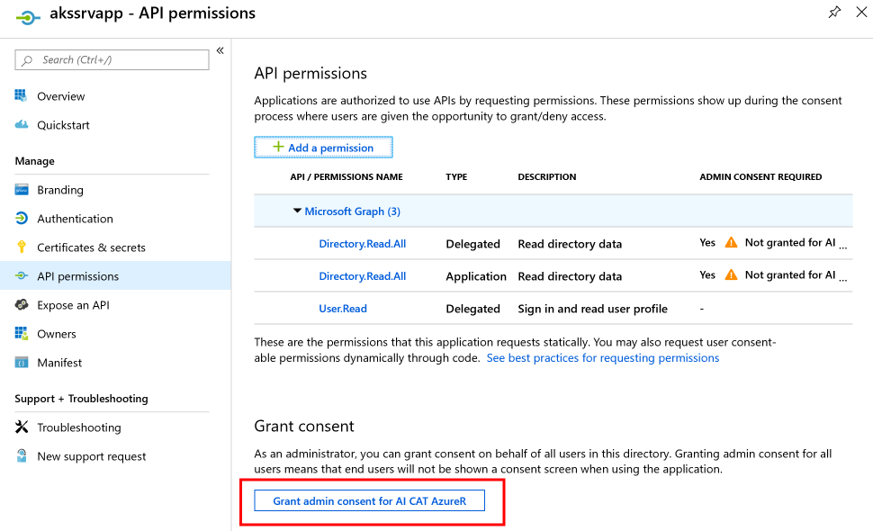

Working with role-based access control (RBAC) can be tricky, especially when containers are involved. This vignette provides example code snippets to handle some common use cases.

## Authenticating with a service principal from ACI to ACR

This covers the scenario where you want to deploy an image to a container instance using a service principal, rather than the registry's admin credentials.

```r
library(AzureGraph)
az <- AzureRMR::get_azure_login()
gr <- AzureGraph::get_graph_login()

# create the registry
rg <- az$
    get_subscription("sub_id")$
    get_resource_group("rgname")

acr <- rg$create_acr("myacr")

# create an app and give it pull access to the registry
app <- gr$create_app("mycontainerapp")
acr$add_role_assignment(app, "Acrpull")

# build and push an image
call_docker("build -t myimage .")
reg <- acr$get_docker_registry()
reg$push("myimage")

# create an ACI credentials object containing the app ID and password
creds <- aci_creds("myacr.azurecr.io", username=app$properties$appId, password=app$password)

# create the instance, passing it the credentials object
rg$create_aci("myinstance", image="myacr.azurecr.io/myimage",
    registry_creds=creds)
```

## Authenticating with a service principal from AKS to ACR

This is the corresponding scenario for a Kubernetes cluster. We'll reuse the registry from the above example.

```r
# create the AKS resource
aks <- rg$create_aks("myaks", agent_pools=aks_pools("pool1", 2), enable_rbac=TRUE)

# get the app ID for the cluster service principal
aks_app_id <- aks$properties$servicePrincipalProfile$clientID

# give the app pull access to the registry
reg$add_role_assignment(gr$get_app(aks_app_id), "Acrpull")
```

After giving the cluster service principal the necessary permissions, you can then deploy images from the registry as normal.

## Integrating AKS with Azure Active Directory

Integrating AKS and AAD requires creating two registered apps, the client and server, and giving them permissions to talk to each other. Most of the work here is actually done using the AzureGraph package; once the apps are correctly configured, we then pass them to the `create_aks` method.

```r
# create the server app
srvapp <- gr$create_app("akssrvapp")

# save the app ID and password
srvapp_id <- srvapp$properties$appId
srvapp_pwd <- srvapp$password

# update group membership claims
srvapp$update(groupMembershipClaims="all")

# update API permissions (Directory.Read.All scope & role, User.Read.All)
srvapp$update(requiredResourceAccess=list(
    list(
        resourceAppId="00000003-0000-0000-c000-000000000000",
        resourceAccess=list(
            list(id="06da0dbc-49e2-44d2-8312-53f166ab848a", type="Scope"),
            list(id="e1fe6dd8-ba31-4d61-89e7-88639da4683d", type="Scope"),
            list(id="7ab1d382-f21e-4acd-a863-ba3e13f7da61", type="Role")
        )
    )
))

# add OAuth permissions API
srvapp_api <- srvapp$properties$api
srvapp_newapi_id <- uuid::UUIDgenerate()
srvapp_api$oauth2PermissionScopes <- list(
    list(
        adminConsentDescription="AKS",
        adminConsentDisplayName="AKS",
        id=srvapp_newapi_id,
        isEnabled=TRUE,
        type="Admin",
        userConsentDescription=NULL,
        userConsentDisplayName=NULL,
        value="AKS"
    )
)
srvapp$update(api=srvapp_api, identifierUris=I(sprintf("api://%s", srvapp_id)))

# create the client app
cliapp <- gr$create_app("akscliapp")
cliapp_id <- cliapp$properties$appId

# tell the server app to trust the client
srvapp_api <- srvapp$properties$api
srvapp_api$preAuthorizedApplications <- list(
    list(
        appId=cliapp_id,
        permissionIds=list(srvapp_newapi_id)
    )
)
srvapp$update(api=srvapp_api)
```

Once the apps have been configured, we still have to grant admin consent. This is best done in the Azure Portal:

- Click on "Azure Active Directory" in the list of items on the left
- In the AAD blade, click on "App registrations"
- Find the app that you created, and click on it.
- Click on "API permissions".
- Click on the "Grant admin consent" button at the bottom of the pane.



Having created and configured the apps, we can then create the cluster resource.

```r
rg$create_aks("akswithaad", agent_pools=aks_pools("pool1", 2),
    properties=list(
        aadProfile=list(
            clientAppID=cliapp_id,
            serverAppID=srvapp_id,
            serverAppSecret=srvapp_pwd
        )
    ),
    enable_rbac=TRUE
)
```

For more information, see the following Microsoft Docs pages:

- [Enable Azure Active Directory integration](https://docs.microsoft.com/en-us/azure/aks/azure-ad-integration)
- [Use Kubernetes RBAC with Azure AD integration](https://docs.microsoft.com/en-us/azure/aks/azure-ad-rbac)
